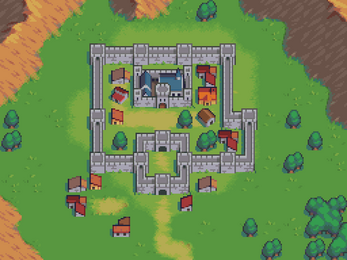

# Interactive SQL Visualizer Concept

This concept transforms SQL queries into visual events in a top-down RPG-style town visualizer. Every SQL command becomes a building, villager, or infrastructure change, creating a living, evolving data town.

## Event Mapping

| SQL Concept         | Visualizer Action                              |
|---------------------|-----------------------------------------------|
| SELECT ... FROM     | Spawn a house for each table touched          |
| WHERE               | Draw roads to filtered houses                 |
| JOIN                | Build walls/bridges between table houses      |
| GROUP BY            | Place a market square with stalls              |
| ORDER BY            | Align road lights in sequence                  |
| INSERT              | Add villagers entering town                   |
| UPDATE              | Upgrade a building level                       |
| DELETE              | Demolish a structure                           |
| CREATE TABLE        | Lay foundations                               |
| DROP TABLE          | Collapse ruins with dust puff                  |

## Sample Visualizer Output

